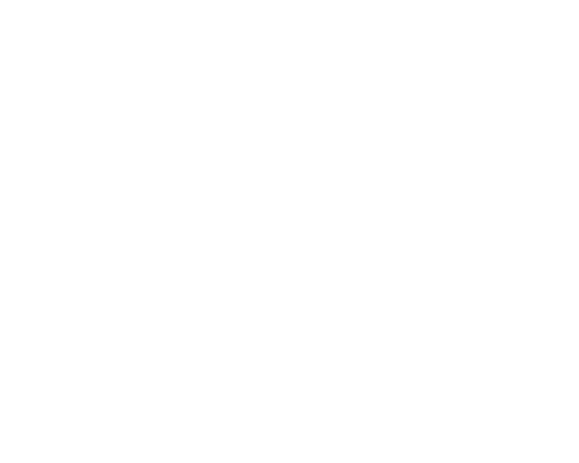

<h3 align="center">Certified Full Stack Developer Curriculum</h3>

    freeCodeCamp Course
     
    <a href="https://www.freecodecamp.org/learn/full-stack-developer/"><strong>Explore the course »</strong></a>
     
     
    <a href="#">View Certification</a>
  

[![The Certification][the-certification]](#)

## About The Project
This project represents a comprehensive implementation of a modern, scalable web application, showcasing my skills as a Certified Full Stack Developer. By leveraging essential frontend and backend technologies, I designed and built a fully functional web application from start to finish.

On the frontend, I utilized HTML, CSS, and JavaScript to create a responsive and dynamic user interface. For enhanced interactivity and maintainability, I integrated React and TypeScript, ensuring a robust and efficient user experience.

For the backend, I implemented server-side solutions using Node.js and Python, managing data efficiently with relational databases. Throughout development, I followed best practices in version control with Git and streamlined package management with Npm.

Through hands-on development, real-world problem-solving, and iterative testing, this project demonstrates my ability to design, build, and deploy a complete web application—proving my readiness for professional full-stack development roles.

[the-certification]: images/screenshot.png